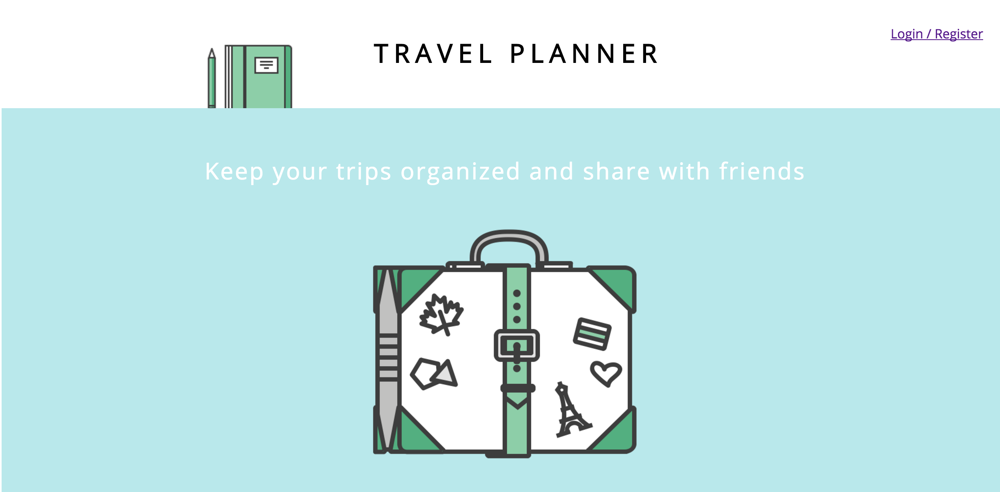
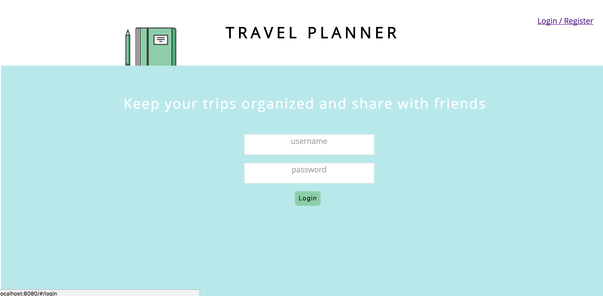
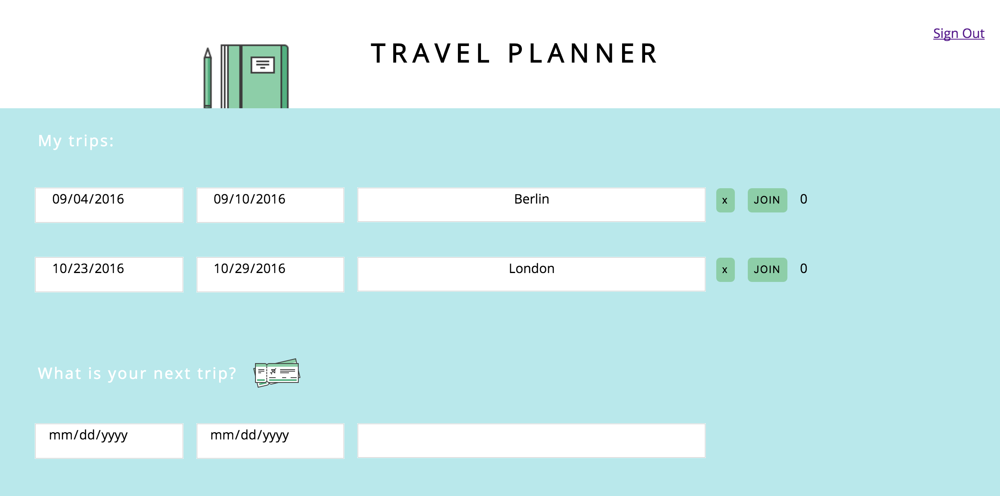

# TravelPlanner:

This app is a simple CRUD app created to simplify sharing your travel itinerary with friends. Implemented using **JavaScript, React Framework, HTML & CSS**.

# How to use the app:

- In order to use the app you need to register, using your e-mail address and creating password.

- After registration you'll be redirected to the userboard

- You'll be able to choose the dates of your trip and destination 

- Once you filled in all the inputs, press 'Enter' and you trip will appear unser "My trips" section

- You can edit or delete your trips later

- You can share the link to your profile with friends and let them 'Join' your trip
